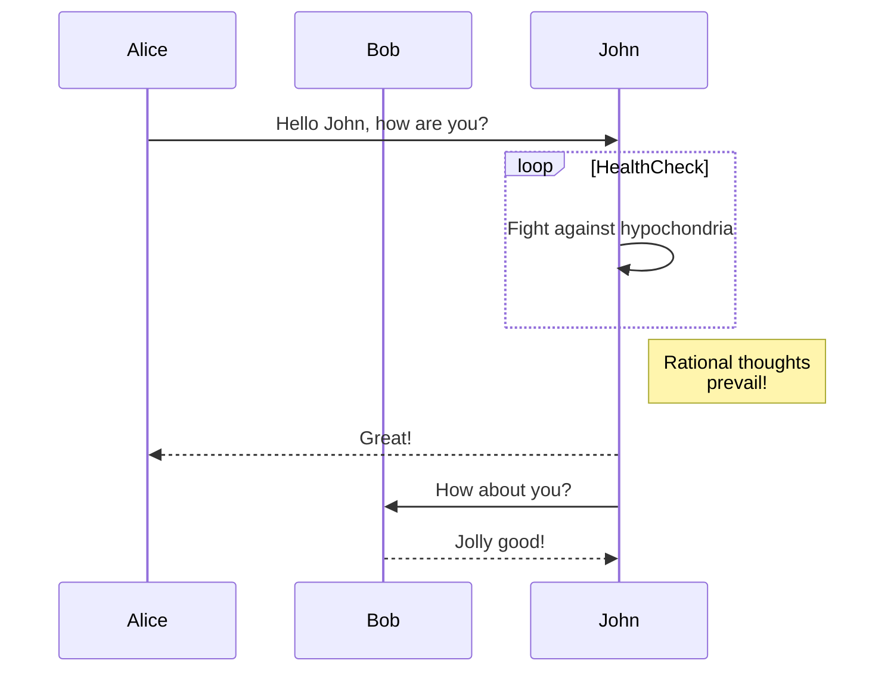

# 一级标题

```mermaid
sequenceDiagram
    participant Alice
    participant Bob
    Alice->>John: Hello John, how are you?
    loop HealthCheck
        John->>John: Fight against hypochondria
    end
    Note right of John: Rational thoughts <br/>prevail!
    John-->>Alice: Great!
    John->>Bob: How about you?
    Bob-->>John: Jolly good!
```

## 二级标题
1. Dog
2. Cat

### 三级标题
```cpp
#include <iostream>

int main()
{
    std::cout << "Hello, World!" << std::endl;
}
```

#### 四级标题
{: width="300" height="300" }
 _avatar_
 